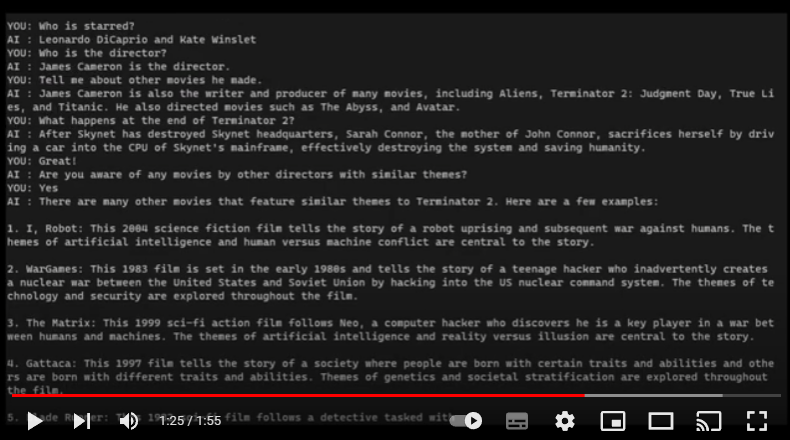

# "RedPajama-INCITE-Chat-3B-v1" hands-on

I have tried RedPajama-INCITE-Chat-3B-v1.

This model was well tuned for chatting and answered so smoothly that it was hard to believe it was a 3B.

I implemented it as a console chat where you and the AI can talk to each other.


## Setup environment

```
conda update -n base -c defaults conda --yes
conda create --yes -n env-rp-3b-chat
conda activate env-rp-3b-chat
conda install python=3.10.10 --yes
python -m pip install --upgrade pip
```

You don't have to stick with conda; pyenv and docker will also work.

## Install packages

```
pip install torch torchvision torchaudio --index-url https://download.pytorch.org/whl/cu117
pip install accelerate transformers
```

## Run

```
python chat.py
```


### Points to be considered

I did not encounter any EOS tokens during sentence generation, 
although there seems to be an EOS token set up.
So, to make the chat look natural, we detect when the model stops talking as an 
AI to finish a sentence. If anyone knows of an effective way to do this,
please let me know in an issue.


### Play on Youtube

 [](https://youtu.be/4TIHkIWmbHI)


## References

- https://huggingface.co/togethercomputer/RedPajama-INCITE-Chat-3B-v1 : Great work!
- https://github.com/riversun/open_llama_7b_hands_on : Code is based on open_llama_7b_hands_on


